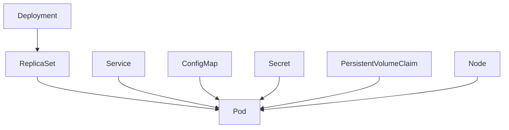

# Kubernetes 核心概念和设计理念

## 🎯 设计哲学

### 声明式 vs 命令式

#### 声明式系统的优势
```yaml
# 声明式：描述期望状态
apiVersion: apps/v1
kind: Deployment
metadata:
  name: nginx-deployment
spec:
  replicas: 3  # 期望状态：3个副本
  selector:
    matchLabels:
      app: nginx
  template:
    metadata:
      labels:
        app: nginx
    spec:
      containers:
      - name: nginx
        image: nginx:1.21
```

#### 控制循环模式
```go
// 核心控制循环
for {
    desired := getDesiredState()      // 获取期望状态
    current := getCurrentState()      // 获取当前状态
    
    if desired != current {
        makeChanges(desired, current) // 调节到期望状态
    }
    
    time.Sleep(reconcileInterval)
}
```

### 分布式系统设计原则

#### 1. 最终一致性
```go
// 示例：Pod 状态更新
type PodStatus struct {
    Phase      PodPhase       `json:"phase,omitempty"`
    Conditions []PodCondition `json:"conditions,omitempty"`
    // 状态最终会收敛到一致
}
```

#### 2. 幂等性操作
```go
// 幂等性：多次执行相同操作结果一致
func (c *Controller) reconcile(key string) error {
    // 无论调用多少次，都产生相同的结果
    return c.ensureDesiredState(key)
}
```

#### 3. 故障容错
```go
// 优雅降级和错误处理
func (c *Controller) processNextWorkItem() bool {
    obj, shutdown := c.workqueue.Get()
    if shutdown {
        return false
    }
    
    defer c.workqueue.Done(obj)
    
    err := c.syncHandler(obj.(string))
    if err == nil {
        c.workqueue.Forget(obj)
        return true
    }
    
    // 重试机制
    if c.workqueue.NumRequeues(obj) < maxRetries {
        c.workqueue.AddRateLimited(obj)
        return true
    }
    
    c.workqueue.Forget(obj)
    return true
}
```

## 🏗️ 核心架构概念

### API 优先设计

#### 1. 统一的 API 模型
```go
// 所有资源都实现 runtime.Object 接口
type Object interface {
    GetObjectKind() schema.ObjectKind
    DeepCopyObject() Object
}

// 统一的元数据结构
type ObjectMeta struct {
    Name      string            `json:"name,omitempty"`
    Namespace string            `json:"namespace,omitempty"`
    Labels    map[string]string `json:"labels,omitempty"`
    // ...
}
```

#### 2. RESTful 资源模型
```bash
# 标准的 REST 操作
GET    /api/v1/namespaces/default/pods      # 列出资源
POST   /api/v1/namespaces/default/pods      # 创建资源
GET    /api/v1/namespaces/default/pods/my-pod  # 获取单个资源
PUT    /api/v1/namespaces/default/pods/my-pod  # 更新资源
DELETE /api/v1/namespaces/default/pods/my-pod  # 删除资源
```

#### 3. 版本化和兼容性
```go
// 多版本支持
// v1/types.go
type Pod struct {
    metav1.TypeMeta   `json:",inline"`
    metav1.ObjectMeta `json:"metadata,omitempty"`
    Spec              PodSpec   `json:"spec,omitempty"`
    Status            PodStatus `json:"status,omitempty"`
}

// v1beta1/types.go - 可能有不同的字段结构
type Pod struct {
    // 向后兼容的字段定义
}
```

### 资源模型

#### 1. 核心资源类型
```yaml
# Pod - 最小调度单元
apiVersion: v1
kind: Pod
metadata:
  name: my-pod
spec:
  containers:
  - name: app
    image: nginx

# Service - 服务发现和负载均衡
apiVersion: v1
kind: Service
metadata:
  name: my-service
spec:
  selector:
    app: my-app
  ports:
  - port: 80
    targetPort: 8080

# Deployment - 声明式更新
apiVersion: apps/v1
kind: Deployment
metadata:
  name: my-deployment
spec:
  replicas: 3
  selector:
    matchLabels:
      app: my-app
  template:
    # Pod 模板
```

#### 2. 资源关系


### 控制器模式

#### 1. Controller 接口
```go
// 标准控制器接口
type Controller interface {
    // 启动控制器
    Run(stopCh <-chan struct{})
    
    // 检查是否已同步
    HasSynced() bool
}

// 典型的控制器实现
type DeploymentController struct {
    client        clientset.Interface
    deploymentLister  appslisters.DeploymentLister
    replicaSetLister  appslisters.ReplicaSetLister
    podLister         corelisters.PodLister
    
    workqueue         workqueue.RateLimitingInterface
    // ...
}
```

#### 2. Informer 模式
```go
// Informer 提供本地缓存和事件通知
func (c *Controller) setupInformers(factory informers.SharedInformerFactory) {
    deploymentInformer := factory.Apps().V1().Deployments()
    
    // 添加事件处理器
    deploymentInformer.Informer().AddEventHandler(cache.ResourceEventHandlerFuncs{
        AddFunc: func(obj interface{}) {
            c.enqueue(obj)
        },
        UpdateFunc: func(oldObj, newObj interface{}) {
            c.enqueue(newObj)
        },
        DeleteFunc: func(obj interface{}) {
            c.enqueue(obj)
        },
    })
    
    c.deploymentLister = deploymentInformer.Lister()
}
```

#### 3. Work Queue 模式
```go
// 工作队列处理事件
func (c *Controller) runWorker() {
    for c.processNextWorkItem() {
    }
}

func (c *Controller) processNextWorkItem() bool {
    obj, shutdown := c.workqueue.Get()
    if shutdown {
        return false
    }
    
    defer c.workqueue.Done(obj)
    
    key := obj.(string)
    err := c.syncHandler(key)
    
    if err == nil {
        c.workqueue.Forget(obj)
        return true
    }
    
    // 处理错误和重试
    c.handleError(err, obj)
    return true
}
```

## 🔧 关键技术概念

### 1. etcd 存储

#### 数据模型
```bash
# Kubernetes 在 etcd 中的存储结构
/registry/pods/default/my-pod           # Pod 数据
/registry/services/default/my-service   # Service 数据
/registry/deployments/default/my-app    # Deployment 数据
```

#### 一致性保证
```go
// etcd 提供强一致性
type StorageInterface interface {
    Create(ctx context.Context, key string, obj, out runtime.Object, ttl uint64) error
    Delete(ctx context.Context, key string, out runtime.Object, preconditions *Preconditions) error
    Watch(ctx context.Context, key string, resourceVersion string, p SelectionPredicate) (watch.Interface, error)
    // ...
}
```

### 2. Watch 机制

#### 事件流
```go
// Watch 提供实时事件流
type Event struct {
    Type   EventType     `json:"type"`
    Object runtime.Object `json:"object"`
}

type EventType string
const (
    Added    EventType = "ADDED"
    Modified EventType = "MODIFIED"
    Deleted  EventType = "DELETED"
    Error    EventType = "ERROR"
)
```

#### 客户端实现
```go
// 客户端 Watch 示例
watcher, err := client.CoreV1().Pods("default").Watch(context.TODO(), metav1.ListOptions{})
if err != nil {
    return err
}

for event := range watcher.ResultChan() {
    pod := event.Object.(*v1.Pod)
    
    switch event.Type {
    case watch.Added:
        fmt.Printf("Pod %s was created\n", pod.Name)
    case watch.Modified:
        fmt.Printf("Pod %s was updated\n", pod.Name)
    case watch.Deleted:
        fmt.Printf("Pod %s was deleted\n", pod.Name)
    }
}
```

### 3. 调度模型

#### 调度决策流程
```go
// 调度器核心流程
func (sched *Scheduler) scheduleOne(ctx context.Context) {
    pod := sched.NextPod()  // 获取待调度 Pod
    
    // 1. 预过滤
    preFilterResult, status := sched.Framework.RunPreFilterPlugins(ctx, state, pod)
    if !status.IsSuccess() {
        return
    }
    
    // 2. 过滤节点
    feasibleNodes, status := sched.Framework.RunFilterPlugins(ctx, state, pod, nodes)
    if !status.IsSuccess() {
        return
    }
    
    // 3. 评分
    priorityList, status := sched.Framework.RunScorePlugins(ctx, state, pod, feasibleNodes)
    if !status.IsSuccess() {
        return
    }
    
    // 4. 选择最优节点
    host, err := sched.selectHost(priorityList)
    if err != nil {
        return
    }
    
    // 5. 绑定 Pod 到节点
    err = sched.bind(ctx, pod, host)
}
```

#### 调度插件
```go
// 调度插件接口
type FilterPlugin interface {
    Plugin
    Filter(ctx context.Context, state *CycleState, pod *v1.Pod, nodeInfo *NodeInfo) *Status
}

type ScorePlugin interface {
    Plugin
    Score(ctx context.Context, state *CycleState, pod *v1.Pod, nodeName string) (int64, *Status)
}

// 示例：NodeResourcesFit 插件
func (f *NodeResourcesFit) Filter(ctx context.Context, state *CycleState, pod *v1.Pod, nodeInfo *NodeInfo) *Status {
    if nodeInfo.Allocatable.AllowedPodNumber < len(nodeInfo.Pods)+1 {
        return NewStatus(Unschedulable, "node has no available pod slots")
    }
    
    if !fitsRequest(computePodResourceRequest(pod), nodeInfo.Allocatable) {
        return NewStatus(Unschedulable, "insufficient resources")
    }
    
    return nil
}
```

### 4. 网络模型

#### Container Network Interface (CNI)
```go
// CNI 插件接口
type CNI interface {
    AddNetworkList(ctx context.Context, net *NetworkConfigList, rt *RuntimeConf) (types.Result, error)
    DelNetworkList(ctx context.Context, net *NetworkConfigList, rt *RuntimeConf) error
}

// 网络配置
type NetworkConfigList struct {
    CNIVersion string         `json:"cniVersion"`
    Name       string         `json:"name"`
    Plugins    []*NetworkConfig `json:"plugins"`
}
```

#### Service 网络实现
```go
// kube-proxy 实现服务发现
type ServicePortName struct {
    NamespacedName types.NamespacedName
    Port           string
    Protocol       v1.Protocol
}

type BaseServiceInfo struct {
    clusterIP                net.IP
    port                     int
    protocol                 v1.Protocol
    nodePort                 int
    loadBalancerStatus       v1.LoadBalancerStatus
    sessionAffinityType      v1.ServiceAffinity
    stickyMaxAgeSeconds      int
    externalIPs              []net.IP
    loadBalancerSourceRanges []net.IPNet
    healthCheckNodePort      int
    onlyNodeLocalEndpoints   bool
    topologyKeys             []string
}
```

## 🔐 安全模型

### 认证 (Authentication)

#### 多种认证方式
```go
// 认证器接口
type Authenticator interface {
    AuthenticateRequest(req *http.Request) (*Response, bool, error)
}

// X.509 证书认证
type x509Authenticator struct {
    roots *x509.CertPool
    // ...
}

// Bearer Token 认证
type bearerTokenAuthenticator struct {
    tokenValidator TokenValidator
}

// OIDC 认证
type oidcAuthenticator struct {
    issuerURL    string
    clientID     string
    keySet       oidc.KeySet
    // ...
}
```

### 授权 (Authorization)

#### RBAC 模型
```yaml
# Role 定义权限
apiVersion: rbac.authorization.k8s.io/v1
kind: Role
metadata:
  namespace: default
  name: pod-reader
rules:
- apiGroups: [""]
  resources: ["pods"]
  verbs: ["get", "watch", "list"]

# RoleBinding 绑定用户和角色
apiVersion: rbac.authorization.k8s.io/v1
kind: RoleBinding
metadata:
  name: read-pods
  namespace: default
subjects:
- kind: User
  name: jane
  apiGroup: rbac.authorization.k8s.io
roleRef:
  kind: Role
  name: pod-reader
  apiGroup: rbac.authorization.k8s.io
```

#### 授权决策
```go
// 授权器接口
type Authorizer interface {
    Authorize(ctx context.Context, a Attributes) (Decision, string, error)
}

type Decision int
const (
    DecisionDeny Decision = iota
    DecisionAllow
    DecisionNoOpinion
)

// RBAC 授权器实现
func (r *RBACAuthorizer) Authorize(ctx context.Context, attributes Attributes) (Decision, string, error) {
    rules, err := r.rulesFor(attributes.GetUser(), attributes.GetNamespace())
    if err != nil {
        return DecisionNoOpinion, "", err
    }
    
    if RulesAllow(attributes, rules...) {
        return DecisionAllow, "", nil
    }
    
    return DecisionDeny, "", nil
}
```

### 准入控制 (Admission Control)

#### 准入控制器
```go
// 准入控制器接口
type Interface interface {
    Admit(ctx context.Context, a Attributes, o ObjectInterfaces) error
}

type MutatingInterface interface {
    Interface
    Mutate(ctx context.Context, a Attributes, o ObjectInterfaces) error
}

type ValidatingInterface interface {
    Interface
    Validate(ctx context.Context, a Attributes, o ObjectInterfaces) error
}
```

#### Webhook 实现
```go
// Admission Webhook
type Webhook struct {
    hookSource   HookSource
    name         string
    clientManager *webhookclient.ClientManager
    // ...
}

func (w *Webhook) Admit(ctx context.Context, a admission.Attributes, o admission.ObjectInterfaces) error {
    request := &admissionv1.AdmissionRequest{
        UID:    types.UID(uuid.New().String()),
        Kind:   a.GetKind(),
        Object: runtime.RawExtension{Object: a.GetObject()},
        // ...
    }
    
    response, err := w.callWebhook(ctx, request)
    if err != nil {
        return err
    }
    
    if !response.Allowed {
        return admission.NewForbidden(a, errors.New(response.Message))
    }
    
    return nil
}
```

## 📊 可观测性

### 指标监控
```go
// Prometheus 指标定义
var (
    requestCounter = prometheus.NewCounterVec(
        prometheus.CounterOpts{
            Name: "apiserver_request_total",
            Help: "Counter of apiserver requests broken out for each verb, API resource, client, and HTTP response contentType and code.",
        },
        []string{"verb", "resource", "client", "contentType", "code"},
    )
    
    requestLatency = prometheus.NewHistogramVec(
        prometheus.HistogramOpts{
            Name: "apiserver_request_duration_seconds",
            Help: "Response latency distribution in seconds for each verb, dry run value, group, version, resource, subresource, scope and component.",
        },
        []string{"verb", "resource"},
    )
)
```

### 结构化日志
```go
import "k8s.io/klog/v2"

// 结构化日志记录
klog.InfoS("Pod created successfully",
    "pod", klog.KObj(pod),
    "node", nodeName,
    "duration", time.Since(start),
)

klog.ErrorS(err, "Failed to create pod",
    "pod", klog.KObj(pod),
    "reason", "ResourceQuotaExceeded",
)
```

### 分布式追踪
```go
import "go.opentelemetry.io/otel/trace"

func (r *Request) Do(ctx context.Context) Result {
    ctx, span := tracer.Start(ctx, "http-request",
        trace.WithAttributes(
            attribute.String("method", r.verb),
            attribute.String("url", r.URL().String()),
        ),
    )
    defer span.End()
    
    // 执行请求
    result := r.doRequest(ctx)
    
    // 记录结果
    span.SetAttributes(
        attribute.Int("status_code", result.statusCode),
        attribute.String("content_type", result.contentType),
    )
    
    return result
}
```

## 🎯 设计模式应用

### 1. 观察者模式
```go
// Informer 实现观察者模式
type ResourceEventHandler interface {
    OnAdd(obj interface{})
    OnUpdate(oldObj, newObj interface{})
    OnDelete(obj interface{})
}
```

### 2. 策略模式
```go
// 调度器插件策略
type Plugin interface {
    Name() string
}

type FilterPlugin interface {
    Plugin
    Filter(ctx context.Context, state *CycleState, pod *v1.Pod, nodeInfo *NodeInfo) *Status
}
```

### 3. 工厂模式
```go
// 客户端工厂
type Factory interface {
    ToRESTConfig() (*rest.Config, error)
    KubernetesClientSet() (kubernetes.Interface, error)
    DynamicClient() (dynamic.Interface, error)
}
```

### 4. 单例模式
```go
// Scheme 单例
var (
    scheme     = runtime.NewScheme()
    codecs     = serializer.NewCodecFactory(scheme)
    localSchemeBuilder = &v1.SchemeBuilder
    // ...
)
```

---

*深入理解这些核心概念将为您的源码阅读打下坚实基础！*
