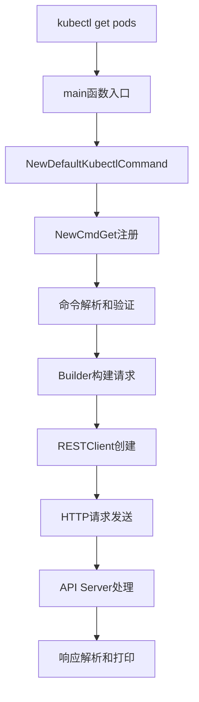
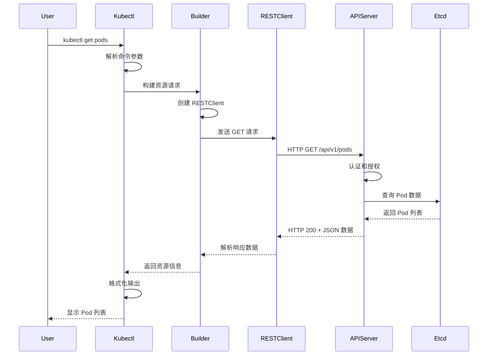

# kubectl get pods 命令完整执行流程分析

## 🎯 概述

本文档详细分析了 `kubectl get pods` 命令从入口到 API 调用的完整执行流程，帮助理解 Kubernetes 客户端的工作机制。

## 📋 执行流程概览



## 🔍 详细执行流程

### 1. 程序入口 (cmd/kubectl/kubectl.go)

```go
func main() {
    logs.GlogSetter(cmd.GetLogVerbosity(os.Args))
    command := cmd.NewDefaultKubectlCommand()  // 创建根命令
    if err := cli.RunNoErrOutput(command); err != nil {
        util.CheckErr(err)
    }
}
```

**关键点：**
- 设置日志级别
- 创建默认的 kubectl 命令结构
- 使用 `cli.RunNoErrOutput` 执行命令

### 2. 命令注册 (staging/src/k8s.io/kubectl/pkg/cmd/cmd.go)

```go
func NewDefaultKubectlCommand() *cobra.Command {
    // ... 省略其他代码 ...
    
    // 注册 get 命令
    getCmd := get.NewCmdGet("kubectl", f, o.IOStreams)
    getCmd.ValidArgsFunction = utilcomp.ResourceTypeAndNameCompletionFunc(f)
    
    // 添加到命令组
    groups := templates.CommandGroups{
        {
            Message: "Basic Commands (Intermediate):",
            Commands: []*cobra.Command{
                explain.NewCmdExplain("kubectl", f, o.IOStreams),
                getCmd,  // get 命令在这里注册
                edit.NewCmdEdit(f, o.IOStreams),
                delete.NewCmdDelete(f, o.IOStreams),
            },
        },
    }
}
```

**关键点：**
- 使用 Cobra 框架管理命令行
- `get.NewCmdGet` 创建 get 子命令
- 设置自动补全功能

### 3. Get 命令定义 (staging/src/k8s.io/kubectl/pkg/cmd/get/get.go)

```go
func NewCmdGet(parent string, f cmdutil.Factory, streams genericiooptions.IOStreams) *cobra.Command {
    o := NewGetOptions(parent, streams)
    
    cmd := &cobra.Command{
        Use:   fmt.Sprintf("get [(-o|--output=)%s] (TYPE[.VERSION][.GROUP] [NAME | -l label] | TYPE[.VERSION][.GROUP]/NAME ...) [flags]", strings.Join(o.PrintFlags.AllowedFormats(), "|")),
        Short: i18n.T("Display one or many resources"),
        Long:  getLong + "\n\n" + cmdutil.SuggestAPIResources(parent),
        Example: getExample,
        Run: func(cmd *cobra.Command, args []string) {
            cmdutil.CheckErr(o.Complete(f, cmd, args))  // 完成参数解析
            cmdutil.CheckErr(o.Validate())              // 验证参数
            cmdutil.CheckErr(o.Run(f, args))            // 执行命令
        },
    }
    
    // 添加各种标志
    o.PrintFlags.AddFlags(cmd)
    cmd.Flags().BoolVarP(&o.Watch, "watch", "w", o.Watch, "After listing/getting the requested object, watch for changes.")
    // ... 更多标志
    
    return cmd
}
```

**关键点：**
- 定义命令的使用方式、描述和示例
- 设置 `Run` 函数作为命令执行入口
- 添加各种命令行标志

### 4. 参数完成和验证

#### Complete 阶段
```go
func (o *GetOptions) Complete(f cmdutil.Factory, cmd *cobra.Command, args []string) error {
    // 获取命名空间
    o.Namespace, o.ExplicitNamespace, err = f.ToRawKubeConfigLoader().Namespace()
    
    // 设置打印选项
    if (len(*o.PrintFlags.OutputFormat) == 0 && len(templateArg) == 0) || *o.PrintFlags.OutputFormat == "wide" {
        o.IsHumanReadablePrinter = true
    }
    
    // 设置打印机函数
    o.ToPrinter = func(mapping *meta.RESTMapping, outputObjects *bool, withNamespace bool, withKind bool) (printers.ResourcePrinterFunc, error) {
        // 创建适当的打印机
        printer, err := printFlags.ToPrinter()
        return printer.PrintObj, nil
    }
    
    return nil
}
```

#### Validate 阶段
```go
func (o *GetOptions) Validate() error {
    // 验证各种标志组合的有效性
    if len(o.Raw) > 0 {
        if o.Watch || o.WatchOnly || len(o.LabelSelector) > 0 {
            return fmt.Errorf("--raw may not be specified with other flags that filter the server request or alter the output")
        }
    }
    // ... 更多验证
    return nil
}
```

### 5. 核心执行逻辑 (Run 方法)

```go
func (o *GetOptions) Run(f cmdutil.Factory, args []string) error {
    // 构建资源请求
    r := f.NewBuilder().
        Unstructured().                                    // 使用非结构化对象
        NamespaceParam(o.Namespace).DefaultNamespace().    // 设置命名空间
        AllNamespaces(o.AllNamespaces).                    // 是否查询所有命名空间
        LabelSelectorParam(o.LabelSelector).               // 标签选择器
        FieldSelectorParam(o.FieldSelector).               // 字段选择器
        Subresource(o.Subresource).                        // 子资源
        RequestChunksOf(chunkSize).                        // 分块大小
        ResourceTypeOrNameArgs(true, args...).             // 资源类型和名称参数
        ContinueOnError().                                 // 遇到错误继续
        Latest().                                          // 获取最新版本
        Flatten().                                         // 扁平化结果
        TransformRequests(o.transformRequests).            // 转换请求
        Do()                                               // 执行请求
    
    // 处理错误
    if err := r.Err(); err != nil {
        return err
    }
    
    // 打印结果
    if !o.IsHumanReadablePrinter {
        return o.printGeneric(r)
    }
    
    // 处理人类可读的打印格式
    return o.printHumanReadable(r)
}
```

### 6. Builder 构建请求 (staging/src/k8s.io/cli-runtime/pkg/resource/builder.go)

```go
func (b *Builder) Do() *Result {
    // 根据不同的参数类型选择不同的访问方式
    if len(b.resources) != 0 {
        return b.visitByResource()  // 按资源类型访问
    }
    if len(b.resourceTuples) != 0 {
        return b.visitByResource()  // 按资源元组访问
    }
    if len(b.paths) != 0 {
        return b.visitByPaths()     // 按文件路径访问
    }
    
    return b.withError(fmt.Errorf("you must provide one or more resources by argument or filename"))
}

func (b *Builder) visitByResource() *Result {
    // 获取资源映射
    mappings, err := b.resourceTupleMappings()
    
    // 为每个资源类型创建客户端
    clients := make(map[string]RESTClient)
    for _, mapping := range mappings {
        client, err := b.getClient(mapping.GroupVersionKind.GroupVersion())
        clients[s] = client
    }
    
    // 创建访问者列表
    items := []Visitor{}
    for _, tuple := range b.resourceTuples {
        mapping := mappings[tuple.Resource]
        client := clients[fmt.Sprintf("%s/%s", mapping.GroupVersionKind.GroupVersion().String(), mapping.Resource.Resource)]
        
        // 创建 REST 访问者
        visitor := NewSelector(
            client,
            mapping,
            b.namespace,
            b.fieldSelector,
            b.labelSelector,
            b.limit,
            b.continueFrom,
        )
        items = append(items, visitor)
    }
    
    return &Result{visitor: VisitorList(items)}
}
```

### 7. RESTClient 创建和请求

#### 客户端创建
```go
func (b *Builder) getClient(gv schema.GroupVersion) (RESTClient, error) {
    // 获取客户端配置
    client, err := b.clientConfigFn.withStdinUnavailable(b.stdinInUse).unstructuredClientForGroupVersion(gv)
    if err != nil {
        return nil, err
    }
    
    // 应用请求转换器
    return NewClientWithOptions(client, b.requestTransforms...), nil
}
```

#### HTTP 请求构建
```go
// staging/src/k8s.io/client-go/rest/client.go
func (c *RESTClient) Get() *Request {
    return c.Verb("GET")
}

func (c *RESTClient) Verb(verb string) *Request {
    return NewRequest(c).Verb(verb)
}
```

#### 请求执行
```go
// staging/src/k8s.io/client-go/rest/request.go
func (r *Request) Do(ctx context.Context) Result {
    // 构建 HTTP 请求
    url := r.URL()
    req, err := http.NewRequest(r.verb, url.String(), r.body)
    
    // 设置请求头
    for key, values := range r.headers {
        for _, value := range values {
            req.Header.Set(key, value)
        }
    }
    
    // 执行 HTTP 请求
    resp, err := r.client.Client.Do(req)
    
    // 处理响应
    return r.transformResponse(resp, req)
}
```

### 8. API Server 处理

当请求到达 API Server 时：

1. **认证和授权**：验证客户端身份和权限
2. **准入控制**：执行各种准入控制器
3. **资源处理**：根据资源类型路由到相应的处理器
4. **存储访问**：从 etcd 中读取数据
5. **响应构建**：构建响应数据

### 9. 响应处理和打印

#### 响应解析
```go
func (r *Request) transformResponse(resp *http.Response, req *http.Request) Result {
    // 检查响应状态
    if resp.StatusCode < 200 || resp.StatusCode > 299 {
        return Result{err: r.transformUnstructuredResponseError(resp, req, body)}
    }
    
    // 解析响应体
    body, err := io.ReadAll(resp.Body)
    if err != nil {
        return Result{err: err}
    }
    
    // 反序列化对象
    obj, err := r.codec.Decode(body, &schema.GroupVersionKind{}, &unstructured.Unstructured{})
    return Result{body: body, wasCreated: false, wasUpdated: false, obj: obj}
}
```

#### 结果打印
```go
func (o *GetOptions) printHumanReadable(r *Result) error {
    // 获取资源信息
    infos, err := r.Infos()
    
    // 创建打印机
    printer, err := o.ToPrinter(mapping, nil, printWithNamespace, printWithKind)
    
    // 打印每个对象
    for _, info := range infos {
        printer.PrintObj(info.Object, w)
    }
    
    return nil
}
```

## 🔧 关键组件说明

### 1. Factory 接口
- 提供统一的客户端创建接口
- 管理 kubeconfig 配置
- 提供 REST 客户端和发现客户端

### 2. Builder 模式
- 使用建造者模式构建复杂的资源请求
- 支持链式调用
- 处理各种参数和选项

### 3. Visitor 模式
- 实现访问者模式遍历资源
- 支持不同类型的资源访问方式
- 提供统一的访问接口

### 4. RESTClient
- 封装 HTTP 客户端
- 处理认证和序列化
- 提供重试和错误处理

## 📊 数据流向图



## 🎯 学习要点

### 1. 命令解析
- 理解 Cobra 框架的使用
- 掌握命令行参数的处理方式
- 了解命令的注册和路由机制

### 2. 客户端架构
- 理解 Factory 模式的作用
- 掌握 Builder 模式的使用
- 了解 Visitor 模式的应用

### 3. HTTP 通信
- 理解 REST 客户端的封装
- 掌握请求构建和执行过程
- 了解响应处理和错误处理

### 4. 资源管理
- 理解 Kubernetes 资源模型
- 掌握资源映射和版本处理
- 了解命名空间和标签选择器

## 📚 相关源码文件

| 文件路径 | 作用 | 关键内容 |
|---------|------|---------|
| `cmd/kubectl/kubectl.go` | 程序入口 | main 函数 |
| `staging/src/k8s.io/kubectl/pkg/cmd/cmd.go` | 命令注册 | NewDefaultKubectlCommand |
| `staging/src/k8s.io/kubectl/pkg/cmd/get/get.go` | Get 命令实现 | NewCmdGet, GetOptions |
| `staging/src/k8s.io/cli-runtime/pkg/resource/builder.go` | 资源构建器 | Builder, Result |
| `staging/src/k8s.io/client-go/rest/client.go` | REST 客户端 | RESTClient, Request |
| `staging/src/k8s.io/client-go/rest/request.go` | 请求处理 | Request.Do |

## 🚀 下一步学习建议

1. **深入理解 client-go**：学习 Informer、Controller 等高级特性
2. **研究 API Machinery**：了解类型系统、序列化等底层机制
3. **分析其他命令**：对比 `kubectl apply`、`kubectl create` 等命令的实现
4. **实践开发**：尝试编写自定义的 kubectl 插件

---

*这个流程分析为理解 Kubernetes 客户端架构提供了坚实的基础，是深入学习源码的重要起点。*
