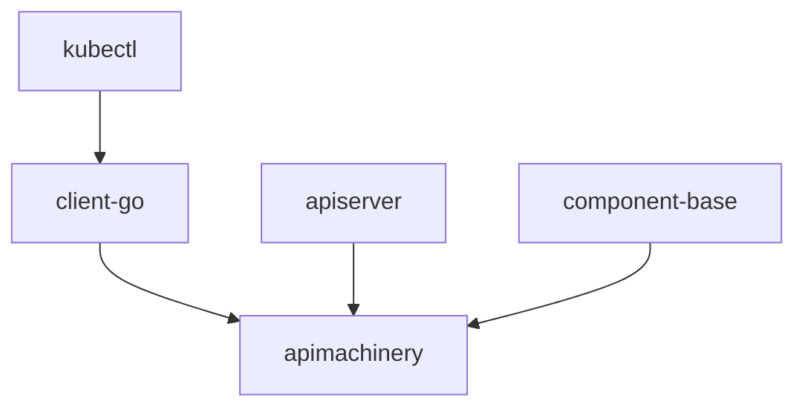

# Kubernetes 项目结构分析

## 🏗️ 整体架构

Kubernetes 是一个大型的 Go 项目，采用模块化设计，主要分为以下几个层次：

### 核心目录结构

```
kubernetes/
├── cmd/                    # 可执行程序入口
├── pkg/                    # 核心业务逻辑
├── staging/                # 独立发布的库
├── vendor/                 # 第三方依赖
├── test/                   # 测试代码
├── hack/                   # 开发和构建脚本
├── build/                  # 构建相关文件
├── cluster/                # 集群部署配置
├── api/                    # API 定义文件
└── docs/                   # 文档
```

## 📦 cmd/ - 可执行程序

### 主要组件

| 组件 | 目录 | 功能 | 
|------|------|------|
| API Server | `cmd/kube-apiserver/` | 集群控制面入口，处理 REST API 请求 |
| Controller Manager | `cmd/kube-controller-manager/` | 运行各种控制器，维护集群状态 |
| Scheduler | `cmd/kube-scheduler/` | Pod 调度决策 |
| Kubelet | `cmd/kubelet/` | 节点代理，管理 Pod 生命周期 |
| Kube Proxy | `cmd/kube-proxy/` | 网络代理，实现服务发现和负载均衡 |
| Kubectl | `cmd/kubectl/` | 命令行客户端工具 |
| Kubeadm | `cmd/kubeadm/` | 集群部署和管理工具 |

### 关键文件结构

```go
// 典型的 cmd 结构
cmd/kube-apiserver/
├── apiserver.go           // main 函数入口
└── app/
    ├── server.go          // 服务器启动逻辑
    ├── options/           // 命令行选项定义
    └── testing/           // 测试辅助代码
```

## 🧩 pkg/ - 核心业务逻辑

### 主要模块

#### API 相关
- `pkg/api/` - 核心 API 定义和验证
- `pkg/apis/` - 内部 API 类型定义
- `pkg/registry/` - API 资源的存储抽象

#### 控制器
- `pkg/controller/` - 各种控制器实现
  - `deployment/` - Deployment 控制器
  - `replicaset/` - ReplicaSet 控制器
  - `job/` - Job 控制器
  - `namespace/` - Namespace 控制器

#### 调度器
- `pkg/scheduler/` - 调度器核心逻辑
  - `framework/` - 调度框架
  - `algorithms/` - 调度算法

#### Kubelet
- `pkg/kubelet/` - Kubelet 核心功能
  - `container/` - 容器管理
  - `pod/` - Pod 管理
  - `volume/` - 存储卷管理

#### 网络代理
- `pkg/proxy/` - Kube-proxy 实现
  - `iptables/` - iptables 模式
  - `ipvs/` - IPVS 模式
  - `winkernel/` - Windows 内核模式

#### 存储
- `pkg/volume/` - 存储卷插件
  - `hostpath/` - HostPath 卷
  - `nfs/` - NFS 卷
  - `csi/` - CSI 插件支持

#### 工具库
- `pkg/util/` - 通用工具函数
- `pkg/auth/` - 认证和授权
- `pkg/features/` - 特性门控

## 🚀 staging/ - 独立库

Staging 目录包含可以独立发布的 Go 模块：

### 核心库

| 库 | 功能 | 用途 |
|----|------|------|
| `client-go` | Kubernetes 客户端库 | 与 K8s API 交互 |
| `apimachinery` | API 机制核心 | 序列化、版本化、类型系统 |
| `apiserver` | API 服务器框架 | 构建 API 服务器 |
| `component-base` | 组件基础库 | 配置、日志、指标 |
| `kubectl` | kubectl 核心功能 | 命令行工具实现 |

### 依赖关系



## 🔧 构建和开发

### hack/ - 开发脚本
- `hack/make-rules/` - 构建规则
- `hack/lib/` - 构建库函数
- `hack/verify-*.sh` - 代码验证脚本
- `hack/update-*.sh` - 代码生成脚本

### build/ - 构建配置
- `build/build-image/` - 构建镜像定义
- `build/dependencies.yaml` - 依赖版本管理
- `build/root/` - 根文件系统

## 🧪 test/ - 测试代码

### 测试类型

| 目录 | 测试类型 | 说明 |
|------|----------|------|
| `test/e2e/` | 端到端测试 | 完整功能测试 |
| `test/integration/` | 集成测试 | 组件间集成测试 |
| `test/e2e_node/` | 节点测试 | Kubelet 相关测试 |
| `test/utils/` | 测试工具 | 测试辅助函数 |

## 📋 配置文件

### 重要配置
- `go.mod` - Go 模块定义
- `Makefile` - 构建配置
- `.go-version` - Go 版本要求
- `OWNERS` - 代码所有者

### API 定义
- `api/openapi-spec/` - OpenAPI 规范
- `api/api-rules/` - API 规则定义

## 🔍 代码导航技巧

### 1. 查找组件入口
```bash
# 查找主要组件的 main 函数
find cmd/ -name "*.go" -exec grep -l "func main" {} \;
```

### 2. 理解 API 定义
```bash
# 查看 API 类型定义
ls staging/src/k8s.io/api/
```

### 3. 追踪控制器逻辑
```bash
# 查找特定控制器
find pkg/controller/ -name "*deployment*"
```

### 4. 学习客户端使用
```bash
# 查看 client-go 示例
ls staging/src/k8s.io/client-go/examples/
```

## 📚 学习建议

### 按复杂度递进

1. **入门** - 从 `cmd/kubectl/` 开始，理解命令行工具
2. **进阶** - 学习 `pkg/api/` 和 `staging/src/k8s.io/client-go/`
3. **深入** - 分析 `pkg/controller/` 中的控制器实现
4. **高级** - 研究 `cmd/kube-apiserver/` 和调度器逻辑

### 工具推荐

- **IDE**: GoLand 或 VS Code with Go extension
- **代码搜索**: `grep`, `ag`, 或 `rg`
- **依赖分析**: `go mod graph`
- **调用追踪**: `go tool trace`

---

*下一步：阅读 [技术栈详解](./tech-stack.md) 了解使用的框架和技术*
